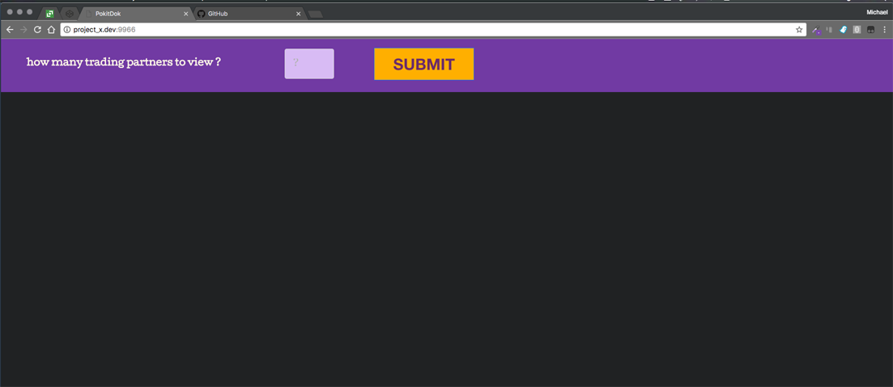
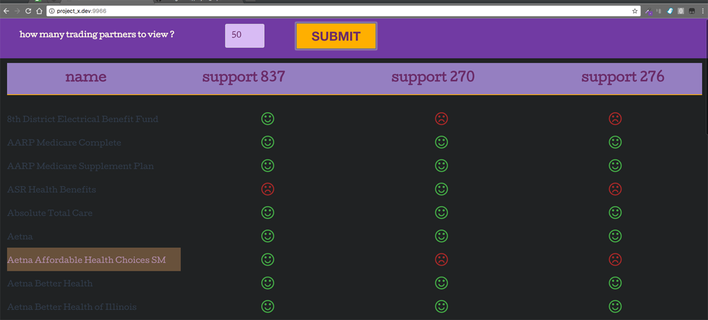

# 
PokitDok Test Application

## Instructions:
- Make a web application that connects to our API
  - https://platform.pokitdok.com
  - the trading partners API endpoint is useful due to number of fields and properties for display.
- You can use whatever you like to connect to the API
  - nodejs client library at https://github.com/pokitdok/pokitdok-nodejs.
- Once you connect and get some data
- Render a webpage that presents it in a way you find useful or just visually pleasing.

---

## Current Solution:
- create an application that will retrieve all trading partners
- allow user to view all or limit the output on the front-end via number input
- each row will contain:
  - the name of trading partner, dimmed in UI until mouseover
  - boolean [.fa-smile-o, .fa-frown-o] to show if partner supports codes [837, 270, 276], this would need to be more robust for production worthy application
  - the input can be edited and resubmitted if needed

---

## Server File:
- [pokitdok.js](https://github.com/mmcgraw73/project_x/blob/pokitdok/pokitdok.js)

---

## Screenshots of Application:
### 
default view on page load

### 
list view following input submit

---

## Development Tools Used:
+ [grunt](http://gruntjs.com/) - javascript task runner
+ [browserify](http://browserify.org/) - front-end dependency management
+ [beefy](http://didact.us/beefy/) - local development server
+ [sass](http://sass-lang.com/) / [primitive](https://taniarascia.github.io/primitive/) - stylesheet language / scss library
+ [node](https://nodejs.org/en/) - open-source, cross-platform JavaScript runtime environment

### ** currently not mobile friendly **  
